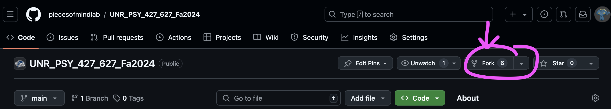
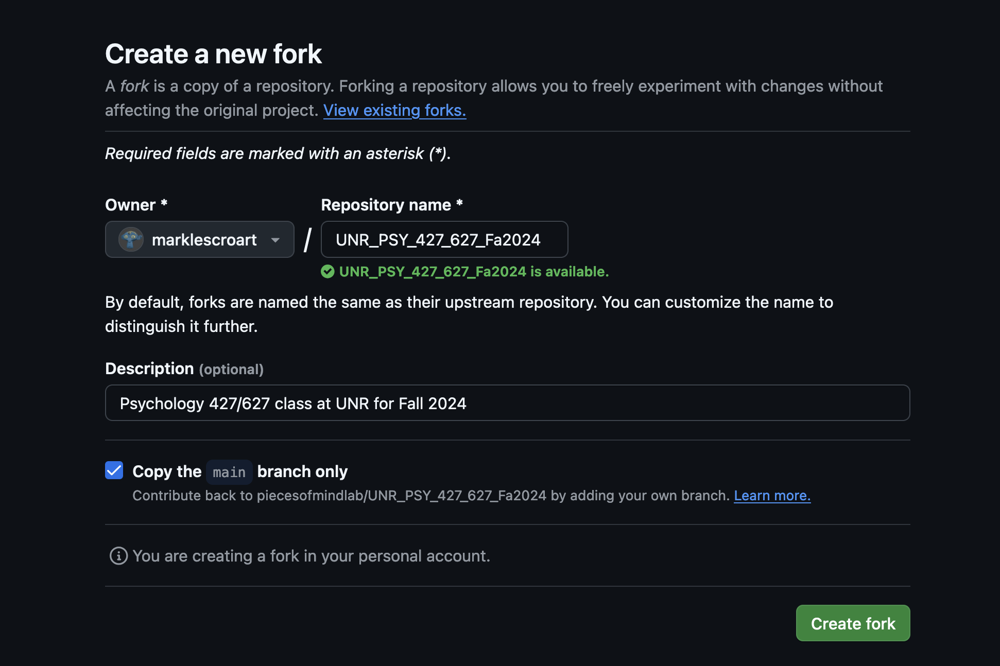

# PSY 427/627 Fall 2024

This repository contains code and code demos for PSY 427/627: Computer Applications in Social and Behavioral Science at UN Reno. 

If you are a student in the course, please fork this repository to your own git account. Assignments will be submitted via your fork. 

Course extra credit will be given for the first student to report any bug in the code provided, 0.5% per bug. 

Bug report template is [here](url), and bugs must be submitted on the issues page on this repo 

# Setting up git

## Create your own git account
Git accounts are free, please create one for yourself if you don't have one! It's the industry-standard way to share code, collaborate on others' code, and showcase your hard work. You will need to choose a user name and password. 

## Fork this repo to your own repo
Once you have created your own account, please fork this repository into your own repository on your own page using the 'fork' button:

You will get a menu like this:

